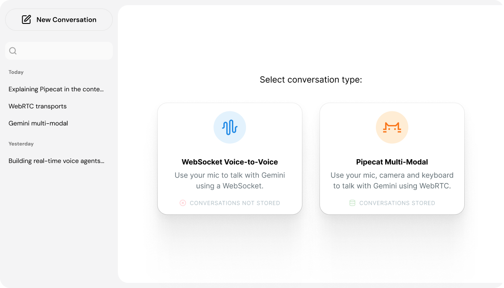

# Chat Application Starter Kit — Gemini Multimodal Live API + Pipecat

This repo is a starter kit showing how to build a full application using the Pipecat Web SDK and the Gemini Multimodal Live API.



**Features:**

- Ephemeral WebSocket voice mode
- Text and image HTTP chat mode
- WebRTC voice, camera, and screenshare chat mode
- Persistent conversation storage to a SQLite database

The Pipecat SDK supports both WebSockets and WebRTC. WebSockets are great for protoyping, and for server-to-server communication.

For realtime apps in production, WebRTC is the right choice. WebRTC was designed specifically for low-latency audio and video. (See [this explainer](https://www.daily.co/videosaurus/websockets-and-webrtc/) for more about WebRTC and WebSockets.)

## Getting setup

➡️ You will need a [Gemini API key](https://aistudio.google.com/app/apikey).

➡️ To use the WebRTC voice mode, you'll also need a [Daily API key](https://dashboard.daily.co/u/signup) (optional).

### Server setup:

You'll need to use Python version 3.10, 3.11, or 3.12 because of various dependencies. On a Mac, the easiest thing to do is `brew install python@3.12`.

```bash
cd server
python3.12 -m venv venv
source venv/bin/activate
pip install -r requirements.txt

# Initialize the project
python sesame.py init

# Run the server
python sesame.py run
```
This will start the Sesame server. You'll need to make note of which port it's running on. Look for a log line that says something like `Uvicorn running on http://127.0.0.1:7860 (Press CTRL+C to quit)`.

### Client setup:

Option 1: Using the Sesame CLI

- From within the `server` directory:

  ```bash
  python sesame.py init-client
  ```

Option 2: Manually

- You can manually create the `.env.local` file in the `./client` directory:

  ```bash
  cd client
  cp env.example .env.local
  ```

  Open your `.env.local` file and make sure `VITE_SERVER_URL=http://127.0.0.1:7860/api` is using the same port as your Sesame server (defaults to 7860).

### Run the client:

In a new terminal window:

```bash
cd client
npm install
npm run dev
```

Visit the URL shown in the terminal. Be sure that both the server and client are running.

## Architecture

### Configuration

System instructions and other configuration parameters are in [server/common/config.py](server/common/config.py).

### Storage

In HTTP and WebRTC mode, conversations are stored in a local SQLite database file [server/sesame.db]. If you want to clear your conversation history, just delete this file. Everything is stored in plain text -- this is not meant to be secure or private storage!

Storage is implemented by [bots/persistent_context.py](bots/persistent_context.py). The database schema is defined in [common/models.py](common/models.py).

### Server architecture

The app backend is a FastAPI app.

API endpoints are defined in [webapp/api](webapp/api).

The SDK uses these two endpoints in [webapp/api/bots.py](webapp/api/bots.py) to send an HTTP chat message, and to connect to a WebRTC voice-mode bot:

- /action
- /connect

The two bot modes are designed to be compatible with each other. Both are implemented as Pipecat pipelines using Gemini models.

The single-turn HTTP pipeline is defined in [`bots/http/bot_pipeline.py`](bots/http/bot_pipeline.py).

The connected-mode WebRTC pipeline is defined in [`bots/webrtc/bot_pipeline.py`](bots/webrtc/bot_pipeline.py).

### Client code

RTVIClient is created in `client/src/components/ClientPage.tsx`.

- `client.action()` is called from `sendTextMessage()` in `client/src/components/ChatControls.tsx`
- `client.connect()` is called from `handleSwitchToVoiceMode()` in `client/src/components/ChatControls.tsx`

RTVI event handlers are set up by the `useRTVIClientEvent` hook. See:

- `client/src/components/BotReadyAudio.tsx`
- `client/src/components/ChatControls.tsx`
- `client/src/components/ChatMessages.tsx`
- `client/src/components/LiveMessages.tsx`

### HTTP single-turn conversation

Each HTTP conversation turn is triggered by a POST to [/api/bot/action](server/webapp/api/bots.py).

The payload is an Pipecat [RTVI](https://docs.pipecat.ai/client/introduction#about-rtvi) action to execute.

```
{
  "conversation_id": "59b50d76-a275-4293-b77f-34d8541cca8a",
  "actions": [
    {
      "label": "rtvi-ai",
      "type": "action",
      "data": {
        "service": "llm",
        "action": "append_to_messages",
        "arguments": [
          {
            "name": "messages",
            "value": [
              {
                "role": "user",
                "content": [
                  {
                    "type": "text",
                    "text": "Say \"success\""
                  }
                ]
              }
            ]
          }
        ]
      },
      "id": "7fb7ad3c"
    }
  ]
}
```

### WebRTC connected, multi-turn conversation

Connected conversations start with a call to `client.connect()`. This starts a server-side Pipecat process and connects the bot and the client to a shared WebRTC session.

The Pipecat Client SDK handles all of this on the client side. On the server side:

- /connect is defined in [server/webapp/api/bots.py](server/webapp/api/bots.py)
- The bot process is started by `bot_launch()` in [server/bots/webrtc/bot.py](server/bots/webrtc/bot.py)
- The Pipecat pipeline is defined in [server/bots/webrtc/bot_pipeline.py](server/bots/webrtc/bot_pipeline.py)
